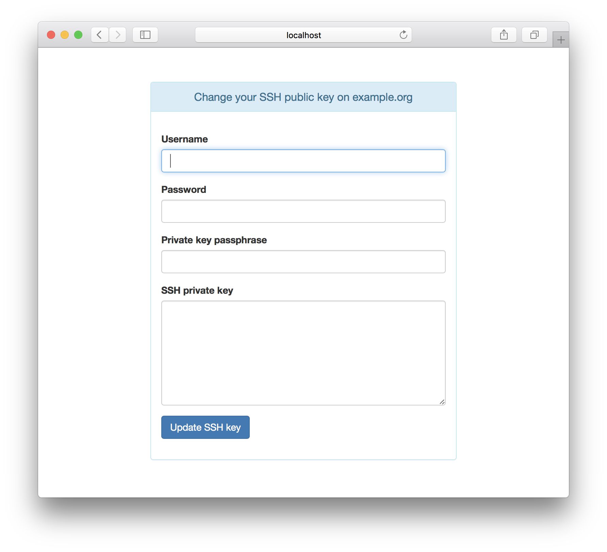

The aim of this project is to provide a very simple web form for users
to be able to change their SSH key stored in LDAP or Active Directory
(Samba 4 AD). It’s built with [Bottle](http://bottlepy.org), a WSGI
micro web-framework for Python.

Installation
============

Manually
--------

Clone this repository and install dependencies:

    git clone git@github.com:jceloria/adkey.git
    cd adkey
    pip install -r requirements.txt

Read the next sections to learn how to run it.

Requirements
------------

-   Python 3.x

-   [bottle](https://pypi.python.org/pypi/bottle/)

-   [ldap3](https://pypi.python.org/pypi/ldap3) 2.x

Configuration
=============

Configuration is read from the file
[settings.ini](settings.ini.example). You may change location of the
settings file using the environment variable `CONF_FILE`.

Run it
======

There are multiple ways how to run it:

-   with the built-in default WSGI server based on
    [wsgiref](https://docs.python.org/3/library/wsgiref.html#module-wsgiref.simple_server),

-   under a
    [WSGI](https://en.wikipedia.org/wiki/Web_Server_Gateway_Interface)
    server like [uWSGI](https://uwsgi-docs.readthedocs.org),
    [Waitress](https://docs.pylonsproject.org/projects/waitress),
    [Gunicorn](http://gunicorn.org), … (recommended)

-   as a [CGI](https://en.wikipedia.org/wiki/Common_Gateway_Interface)
    script.

Run with the built-in server
----------------------------

Simply execute the `adkey.py`:

    python3 adkey.py

Then you can access the app on <http://localhost:8080>. The port and
host may be changed in [settings.ini](settings.ini.example).

Run with Waitress
-----------------

    cd adkey
    waitress-serve --listen=*:8080 app:application

Run with uWSGI and nginx
------------------------

If you have many micro-apps like this, it’s IMO kinda overkill to run
each in a separate uWSGI process, isn’t it? It’s not so well known, but
uWSGI allows to “mount” multiple application in a single uWSGI process
and with a single socket.

**Sample uWSGI configuration:.**

    [uwsgi]
    plugins = python3
    socket = /run/uwsgi/main.sock
    chdir = /var/www/scripts
    logger = file:/var/log/uwsgi/main.log
    processes = 1
    threads = 2
    # map URI paths to applications
    mount = /admin/adkey=adkey/adkey.py
    #mount = /admin/change-world=change-world/adkey.py
    manage-script-name = true

**Sample nginx configuration as a reverse proxy in front of uWSGI:.**

    server {
        listen 443 ssl;
        server_name example.org;

        ssl_certificate     /etc/ssl/nginx/nginx.crt;
        ssl_certificate_key /etc/ssl/nginx/nginx.key;

        # uWSGI scripts
        location /admin/ {
            uwsgi_pass  unix:/run/uwsgi/main.sock;
            include     uwsgi_params;
        }
    }

Screenshot
==========

License
=======

This project is licensed under [MIT
License](http://opensource.org/licenses/MIT/). For the full text of the
license, see the [LICENSE](LICENSE) file.
